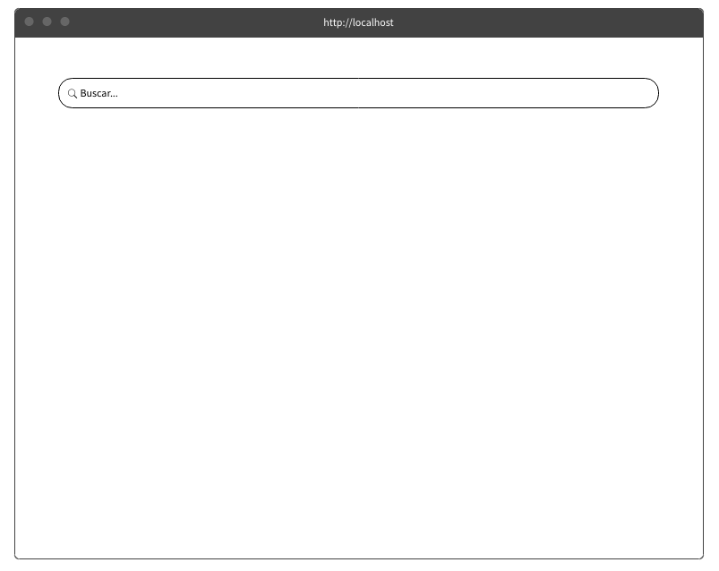
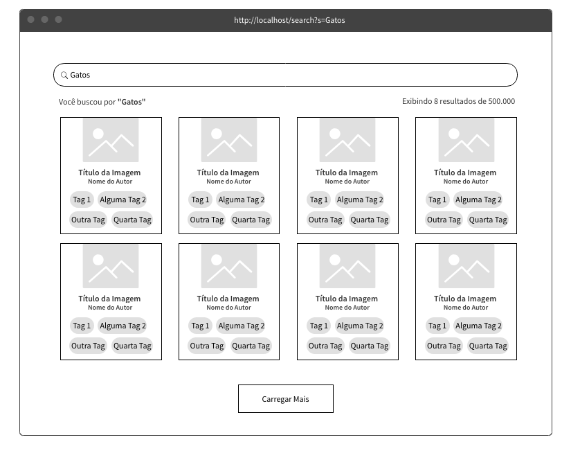
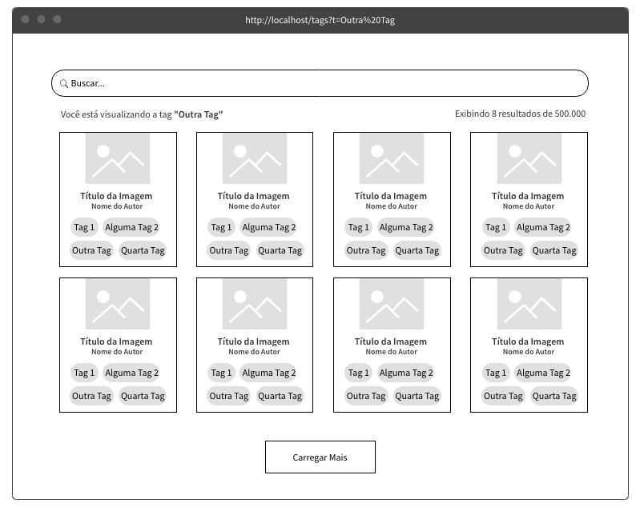
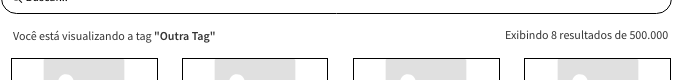

# Teste para Front-end React / Redux

## Objetivo

Seu objetivo neste teste é produzir uma aplicação React com Redux utilizando a [API do Flickr](https://www.flickr.com/services/api/).

Você deverá construir uma UI com um campo de busca onde o usuário irá realizar buscas por imagens e tags do Flickr (para isso, você pode usar o método [search](https://www.flickr.com/services/api/flickr.photos.search.html)).

Esta busca deverá formar um grid de imagens onde, cada elemento, deverá exibir:

- Uma thumb da imagem
- O título da imagem
- O nome do autor (ownername) da imagem
- Uma lista de até 4 tags que a imagem possuir

Uma vez que o grid estiver montado, o usuário poderá clicar em alguma `tag` da imagem e, clicando nesta tag, o grid deverá ser reconstruído com fotos que possuam aquela `tag` que foi clicada.

## Fluxo de Ações

- Quando a aplicação carregar, exibe-se apenas um campo de busca, quando na URL raiz:

> Ex: `http://localhost:3000`

- Ao digitar no campo de busca e der "Enter", será buscado na API o termo digitado e o resultado deverá ser exibido na tela. A URL deve conter o termo de busca no seguinte formato: `/search?s=termo-buscado`.

> Ex: `http://localhost:3000/search?s=Gatos`.

- Com o resultado de busca, se o usuário clicar em alguma TAG exibida abaixo das fotos, uma nova consulta, agora por TAGs, deve ser feita à API e a página deverá exibir imagens que possuem a tag clicada. A URL deve refletir a tag clicada no formato: `/tags?t=nome-da-tag`.

> Ex: `http://localhost:3000/tags?t=Nome%20Da%Tag`

- Você deve considerar exibir o que está sendo buscado ou a tag sendo utilizada para carregar as imagens:

- Também é interessante que você considere o uso de uma paginação ou de um botão "carregar mais", conforme sugerido nas imagens acima.

## O que será avaliado?

Os seguintes pontos serão avaliados em seu projeto:

- Se a solução apresentada contempla os requisitos.
- A clareza e organização do código.
- A sua capacidade de definir bem os componentes, containers e módulos do React.
- Se os componentes estão sendo feitos dentro do modo `Think in React`, priorizando a capacidade de reutilização.
- Se você consegue planejar corretamente o `Storage` do Redux.
- Se sua aplicação funciona bem em diferentes tamanhos de tela/dispositivos. Se possível, utilize `Flexbox`.

## Pontos extras

Você vai conseguir alguns pontos extras se:

- Sua aplicação contiver um README com detalhes de como devemos fazer para instalar e rodar seu APP em nosso ambiente localhost.
- Se você fizer bom uso do browser, como botões voltar/avançar ou, por exemplo, enviar uma URL com parâmetros de busca/tag e a tela carregar já com os resultados desejados (deep link).
- O isolamento e independência entre os Containers, apesar da necessidade de um conversar bem com o outro.
- Nós adoramos testes unitários, estruturais (que tal Snapshots?) e de integração. Mas atenção: não é necessário fazer um coverage exagerado: queremos avaliar sua familiaridade com o assunto.

## A gente vai te amar mais ainda se...

- Você gosta tanto de JSS que nem lembra mais como fazer CSS nativo
- Você utiliza a API `fetch` para chamadas HTTP.
- Você curte um Redux Saga para ajudar no controle de fluxo e efeitos colaterais (mas ok, não é obrigatório).
- Bootstrap era o quê mesmo?
